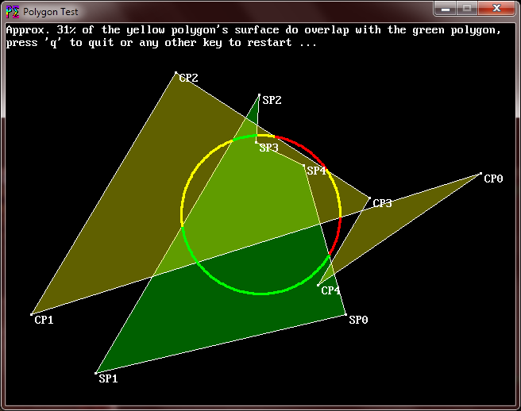
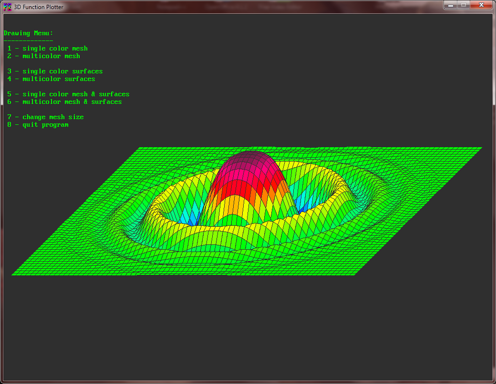
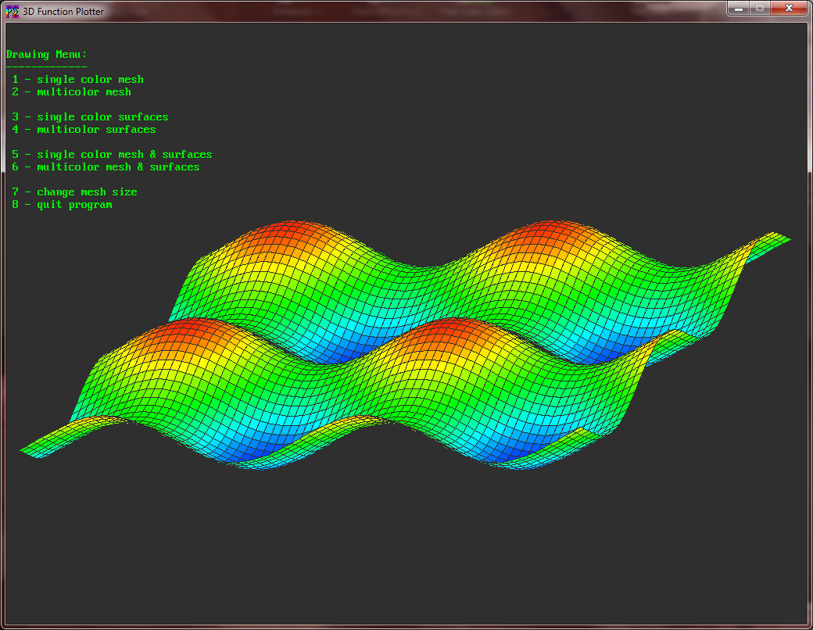

# A collection of useful libraries for QB64
This collection of libraries was developed and has grown over the period of approximately one decade. Most of the libraries were created out of my own need for a particular purpose, but as many of it are of common use, I've decided to put this collection together for everybody.

>**These libraries work with every QB64 version since v0.954, so if you're one of these normal people who not update to the latest build every week, that's not a problem. Just use whatever QB64 version you've installed, as long it's greater or equal to the 0.954 version. This also includes all [Phoenix Edition](https://github.com/QB64-Phoenix-Edition/QB64pe/releases) versions.**

**The main parts are:**

- Imageprocessing effects and filters
- Polygon drawing and analysis (see pictures below)
- The Simplebuffer System
- LZW packing and unpacking
- Base64 encoding and decoding
- MD5 and SHA2 hash generation
- DES-56 encryption and decryption
- several wrappers to standard library functions

#### Download the latest Release December/2022 right here: [QB64Library.7z](https://github.com/RhoSigma-QB64/QB64Library/raw/main/QB64Library.7z)

>**Make sure to move the extracted QB64Library folder with its entire contents into your QB64 installation folder. You find an overview of all libraries in the [QB64Library-Info.html](https://htmlpreview.github.io/?https://github.com/RhoSigma-QB64/QB64Library/blob/main/QB64Library/QB64Library-Info.html) file.**

 

# Some examples which use the Polygon library

  

  

