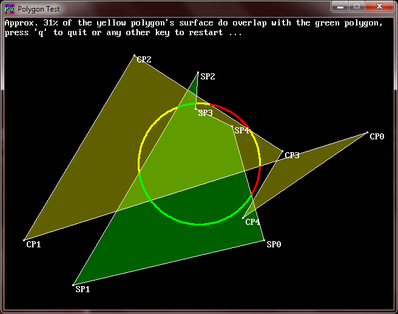
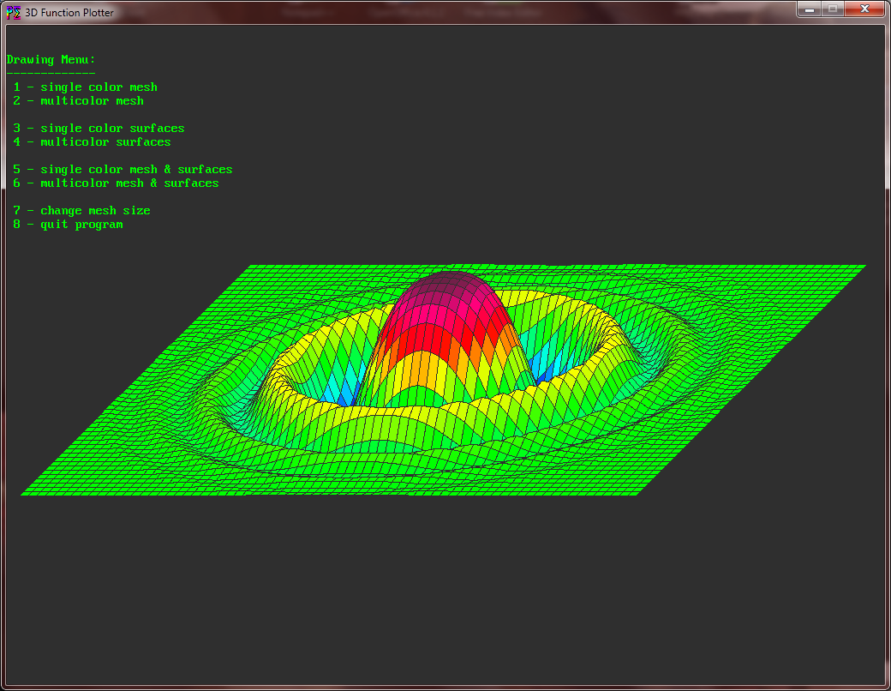
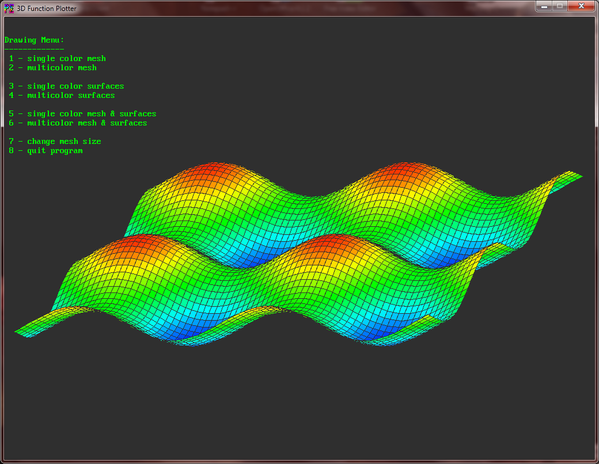

# A collection of useful libraries for QB64
This collection of libraries was developed and has grown over the period of approximately one decade. Most of the libraries were created out of my own need for a particular purpose, but as many of it are of common use, I've decided to put this collection together for everybody.

>**These libraries should work with all recent [QB64-PE (Phoenix Edition)](https://github.com/QB64-Phoenix-Edition/QB64pe/releases) versions and also with the older [QB64 (QB64Team)](https://github.com/QB64Team/qb64/releases) versions.**

**The main parts are:**

- Imageprocessing effects and filters
- Polygon drawing and analysis (see pictures below)
- The Simplebuffer System
- LZW packing and unpacking
- Base64 encoding and decoding
- MD5 and SHA2 hash generation
- DES-56 encryption and decryption
- several wrappers to standard library functions

----------

#### Download the latest Release June/2026 right here: [QB64Library.7z](https://github.com/RhoSigma-QB64/QB64Library/raw/main/QB64Library.7z). The archive's GPG-Signature: [QB64Library.7z.sig](https://github.com/RhoSigma-QB64/QB64Library/raw/main/QB64Library.7z.sig) (check against [RhoSigma's GPG-Key](https://github.com/RhoSigma-QB64/GPG-Key)).

>**Make sure to move the extracted QB64Library folder with its entire contents into your QB64 installation folder. You find an overview of all libraries in the [QB64Library-Info.html](https://htmlpreview.github.io/?https://github.com/RhoSigma-QB64/QB64Library/blob/main/QB64Library/QB64Library-Info.html) file.**

----------

# Some examples which use the Polygon library

  

  

